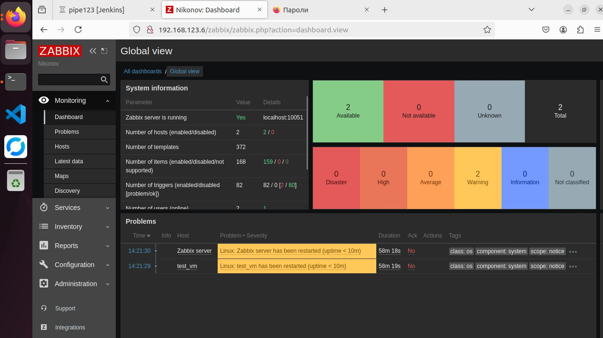
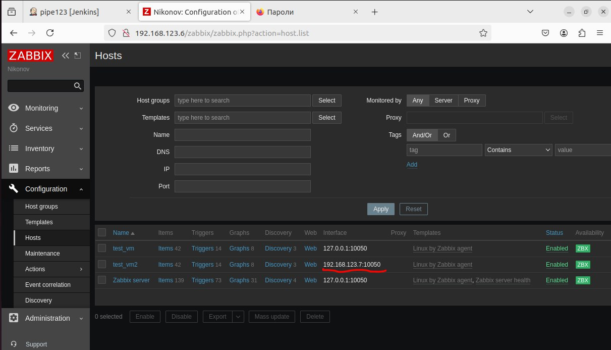
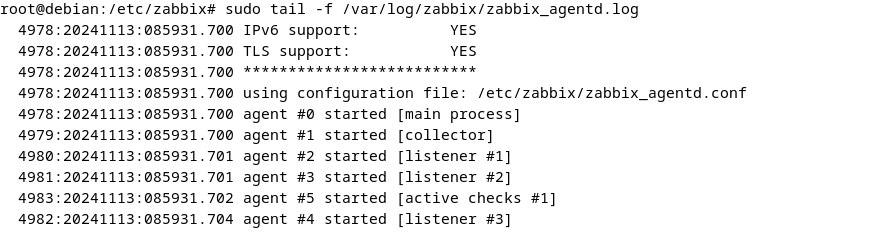
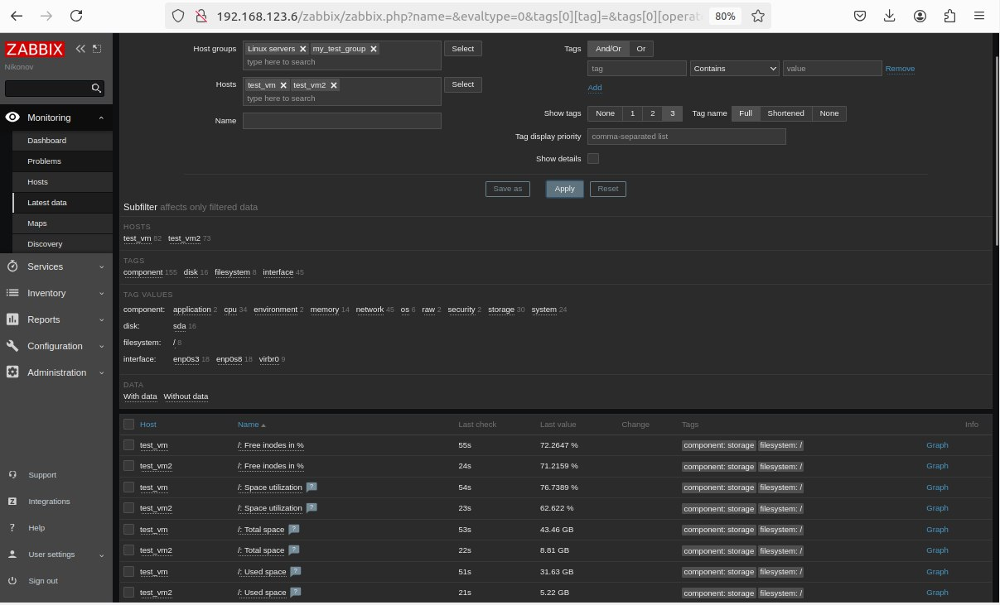

# Домашнее задание к занятию "`Zabbix part1`" - `Nikonov Danila`

### Задание 1

**Zabbix**



**download and start zabbix**
```
wget https://repo.zabbix.com/zabbix/6.0/ubuntu/pool/main/z/zabbix-release/zabbix-release_latest+ubuntu22.04_all.deb 
dpkg -i zabbix-release_latest+ubuntu22.04_all.deb 
apt update
apt install zabbix-server-pgsql zabbix-frontend-php php8.1-pgsql zabbix-apache-conf zabbix-sql-scripts
```
**Add base user and pass**
```
sudo -u postgres createuser --pwprompt zabbix
sudo -u postgres createdb -O zabbix zabbix
sudo su - postgres -c "psql -c \"ALTER USER zabbix WITH PASSWORD '123456789';\""
```
**Add pass to conf**
```
sudo nano /etc/zabbix/zabbix_server.conf
ctrl+W: DBP
DBPassword=123456789 #enter pass
```
**restart and enable** 
```
systemctl restart zabbix-server apache2 
systemctl enable zabbix-server apache2
```
**status** 
```
systemctl status zabbix-server.service
```

---

### Задание 2

**host zabbix**


**log**


**monitoring**



**Install zabbix agent**
```
wget https://repo.zabbix.com/zabbix/6.0/ubuntu/pool/main/z/zabbix-release/zabbix-release_latest+ubuntu22.04_all.deb 
dpkg -i zabbix-release_latest+ubuntu22.04_all.deb 
apt update
apt install zabbix-agent
```
**run**
```
systemctl restart zabbix-agent 
systemctl enable zabbix-agent
```

**config**
```
nano /etc/zabbix/zabbix_server.conf
Server=192.168.123.6
```
